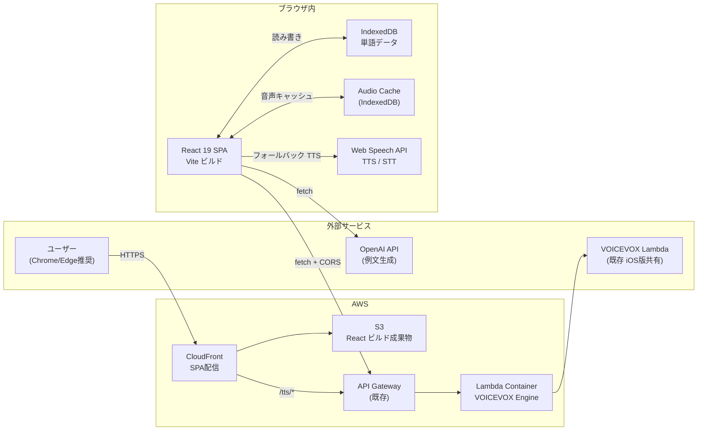

# 設計書 — EnglishLearnApp Web版

**作成日**: 2026-03-20
**対象スタック**: React 19.2 + TypeScript + Vite / S3 + CloudFront / VOICEVOX Lambda（既存）

---

## 概要

iOS版「EnglishLearnApp」のWeb移植版。AI例文生成・VOICEVOX音声合成・発音チェックを組み合わせた英語学習SPAを、React 19.2 + TypeScript で実装し S3 + CloudFront で配信する。バックエンドサーバーは持たず、VOICEVOX Lambda（既存 iOS版インフラを再利用）と OpenAI API をブラウザから直接呼び出すサーバーレス構成とする。

---

## 技術的実現可否
**判断: 対応可能**

React 19 / Web Speech API / IndexedDB / HTML5 Audio API はすべてモダンブラウザで標準的にサポートされており、既存 VOICEVOX Lambda の CORS 設定追加のみで iOS版と同一の音声合成基盤を利用できる。Web Speech API（STT・TTS）は Chrome / Edge に限定されるが、発音チェック機能の利用者はブラウザ指定案内で対応可能。

---

## アーキテクチャ図

---

## アーキテクチャ方針

### フロントエンド
- **技術**: React 19.2 + TypeScript 5.6 + Vite 6 + React Router v7 + Tailwind CSS v4
- **状態管理**: Zustand（グローバル: 再生状態・設定）+ React State（ローカル）
- **データ永続化**: IndexedDB（`idb` ライブラリ経由）— iOS の FileManager JSON 相当
- **音声再生キュー**: `useRef` + HTML5 `Audio` オブジェクトのキュー管理
- **ドラッグ並び替え**: `@dnd-kit/sortable`
- **ルーティング**: React Router v7（SPA / HashRouter → S3対応）

### バックエンド
- **なし（サーバーレス SPA）**
- TTS: 既存 VOICEVOX Lambda エンドポイント（直接呼び出し）
- 例文生成: OpenAI API（ブラウザから直接呼び出し、APIキーは localStorage 保存）
- 認証: なし（個人利用アプリ）

### インフラ（AWS）
| サービス | 役割 | 備考 |
|---------|------|------|
| S3 | React ビルド成果物ホスティング | パブリック非公開、OACで CloudFront のみ許可 |
| CloudFront | HTTPS 配信 + SPA ルーティング | カスタムエラー 404→index.html |
| API Gateway | VOICEVOX Lambda のフロントエンド | 既存 iOS版と共有 |
| Lambda（既存） | VOICEVOX TTS エンジン | CORS 設定追加のみ |
| GitHub Actions | CI/CD + CloudFront Invalidation | |

### データ設計（クライアント）
| ストア | 用途 | iOS相当 |
|-------|------|---------|
| IndexedDB: `words` | 単語・例文・メタデータ | FileManager words.json |
| IndexedDB: `audioCache` | VOICEVOX 音声バイナリ | iOS AudioCache |
| localStorage: `settings` | APIキー・音声設定・プリセット | iOS Keychain + UserDefaults |

---

## 機能一覧と工数見積もり

| # | 機能 | 内容 | 工数（人日） | 備考 |
|---|------|------|-------------|------|
| 1 | 単語リスト画面 | 検索・フィルタ（頭文字/カテゴリ）・ソート・一覧表示 | 3 | |
| 2 | 単語追加・編集 | フォーム・バリデーション・OpenAI例文生成ボタン | 3 | |
| 3 | 例文一覧画面 | カテゴリ別表示・再生ボタン・発音練習遷移 | 2 | |
| 4 | 発音練習画面 | 音声再生 + Web Speech API 録音 + 正誤判定 | 4 | Chrome/Edge限定 |
| 5 | 連続再生（ミニプレイヤー） | 常駐プレイヤー・再生/停止/前後スキップ | 4 | |
| 6 | 連続再生（フルプレイヤー） | ドラッグ並び替え・自動スクロール・Media Session API | 5 | |
| 7 | VOICEVOX TTS 連携 | fetch + IndexedDB 音声キャッシュ + CORS対応 | 3 | |
| 8 | OpenAI 例文生成 | Chat Completions API + structured output | 2 | |
| 9 | Web Speech TTS | フォールバック TTS（Web Speech API） | 1 | |
| 10 | アーカイブ機能 | アーカイブ一覧・復元・一括操作 | 2 | |
| 11 | ゴミ箱機能 | ソフトデリート・10日自動削除・復元 | 2 | |
| 12 | 設定画面 | APIキー・音声設定・モデル選択・プリセット管理 | 3 | |
| 13 | JSON エクスポート/インポート | iOS版互換フォーマット（word_set.json） | 2 | |
| 14 | オンボーディング | APIキー入力案内・初回設定ウィザード | 1 | |
| 15 | AWS インフラ | S3 + CloudFront + CDK + CI/CD | 3 | |
| | **実装 小計** | | **40人日** | |
| T1 | 単体テスト | IndexedDB・OpenAI・VOICEVOXサービス層（Vitest） | 4 | |
| T2 | 結合テスト | API呼び出し・音声キャッシュフロー（MSW モック） | 3 | |
| T3 | E2E テスト | 主要フロー（Playwright: Chrome/Edge） | 5 | |
| T4 | テスト環境構築 | GitHub Actions CI・シードデータ | 2 | |
| | **テスト 小計** | | **14人日** | |
| | **実装 + テスト 合計** | | **54人日** | |
| | **バッファ（25%）** | | **14人日** | |
| | **フェーズ0 PoC** | CORS確認・Web Speech動作確認 | **5人日** | |
| | **総合計** | | **73人日** | |

> ⚠️ 工数詳細合計（73人日）と customer-summary.md の 96人日には差異があります。customer-summary.md ではチーム体制・バッファ幅を保守的に見積もっています。発注時は 96人日をベースに見積もることを推奨します。

---

## フェーズ計画

| フェーズ | スコープ | 期間 |
|---------|---------|------|
| フェーズ0 | CORS確認・Web Speech API PoC・IndexedDB 動作確認 | 1週 |
| フェーズ1 | 単語管理・TTS（VOICEVOX + Web Speech）・OpenAI連携・連続再生・設定 | 6週 |
| フェーズ2 | 発音チェック・QA・S3/CloudFront 本番デプロイ・iOS データ移行 | 3週 |

---

## 不明点・確認事項

- VOICEVOX Lambda の API Gateway エンドポイント URL と API キー（CORS設定追加のため）
- Web版ドメイン（CloudFront カスタムドメイン）の有無・ドメイン名
- Safari ユーザー向け発音チェック機能の対応方針（Chrome必須案内 or 非表示）
- iOS版とのデータ同期要件（不要ならば IndexedDB のみ）
- OpenAI APIキーの管理方針（ユーザー自身が入力 vs バックエンド代理呼び出し）

---

## リスク・考慮事項

- **Web Speech API (STT)**: Chrome / Edge のみ対応。Safari・Firefox 非対応
- **VOICEVOX コールドスタート**: 初回リクエストが最大30秒かかる。ブラウザ側でローディングUI必須
- **OpenAI APIキー露出**: localStorage 保存のため、DevTools で確認可能。個人利用を前提とした設計
- **IndexedDB の容量制限**: ブラウザにより異なる（一般的に数百MB〜）。音声キャッシュが増大した場合の上限管理が必要
- **CORS設定**: 既存 Lambda に本番ドメインの CORS 許可が必要。poc 環境は `*` で暫定対応可
