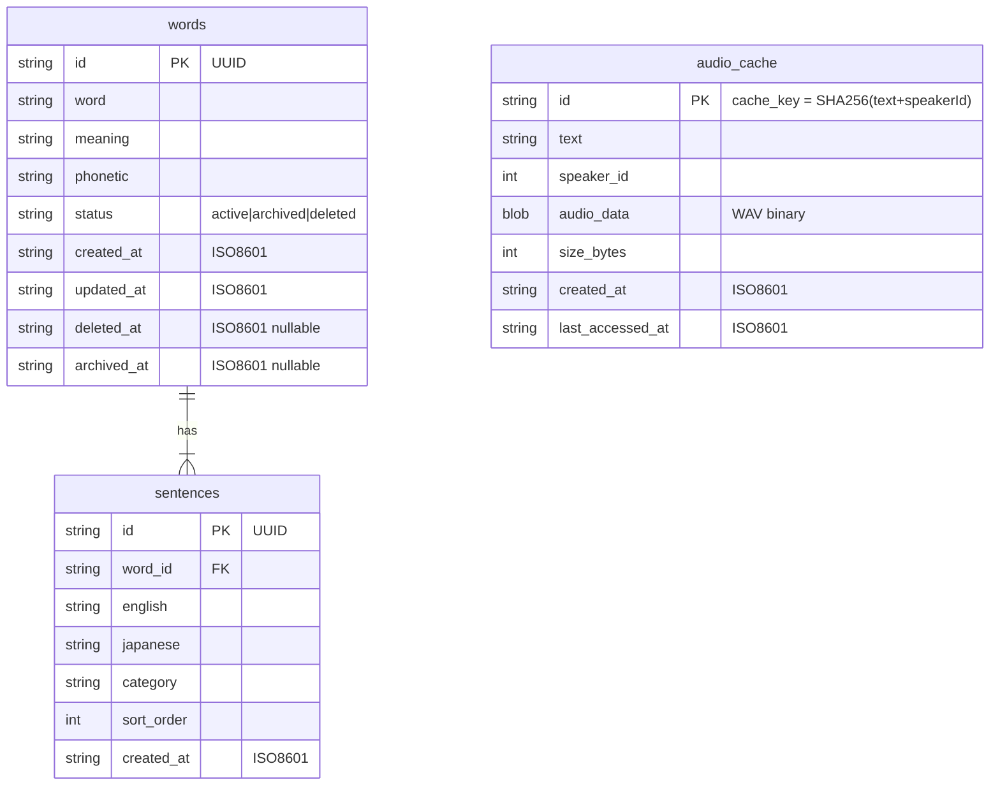

# DB設計書 — EnglishLearnApp Web版

**生成日**: 2026-03-20
**対象スタック**: IndexedDB（クライアントサイド）+ localStorage（設定）

> Web版はバックエンドサーバーを持たないサーバーレス SPA のため、データストアはブラウザ内の **IndexedDB** を採用します。iOS版の `FileManager + words.json` 相当です。将来的なクラウド同期が必要になった場合は RDS PostgreSQL + FastAPI バックエンドへの移行を推奨します。

---

## 1. ストレージ選定

### 選定結果

| ストレージ | 用途 | 採用理由 |
|-----------|------|---------|
| **IndexedDB** | 単語・例文データ・音声キャッシュ | 構造化データの永続保存・大容量対応（数百MB）|
| **localStorage** | 設定・APIキー・プリセット | 軽量な文字列データ・同期アクセス |

### 選定根拠

バックエンドサーバーを持たない構成のため、クライアント側でのデータ永続化が必要。iOS版の `FileManager + words.json` をそのまま移植するには IndexedDB が最適。音声キャッシュはバイナリデータ（数KB〜数百KB/件）のため IndexedDB の Blob ストアが適している。

将来的にクラウド同期が必要になった場合は以下を推奨:
- **RDS PostgreSQL 17** + FastAPI バックエンド（クラウド同期・マルチデバイス対応）
- IndexedDB をオフラインキャッシュとして維持し、同期レイヤーを追加する設計

---

## 2. ER図（IndexedDB オブジェクトストア構造）



---

## 3. オブジェクトストア定義

### IndexedDB: データベース名 `EnglishLearnDB` / バージョン `1`

---

### `words` ストア

**概要**: 英単語のマスタデータ。iOS版 Word モデルと互換。

| フィールド | 型 | 制約 | 説明 |
|-----------|---|------|------|
| `id` | string (UUID) | PK | ランダム UUID |
| `word` | string | required | 英単語 |
| `meaning` | string | required | 日本語訳（iOS `meaning` と同一キー） |
| `phonetic` | string | optional | 発音記号 |
| `status` | string | required | `"active"` / `"archived"` / `"deleted"` |
| `created_at` | string | required | ISO 8601 |
| `updated_at` | string | required | ISO 8601 |
| `deleted_at` | string \| null | optional | ソフトデリート日時 |
| `archived_at` | string \| null | optional | アーカイブ日時 |

**インデックス**:
```typescript
store.createIndex('status', 'status', { unique: false });
store.createIndex('created_at', 'created_at', { unique: false });
store.createIndex('word', 'word', { unique: false });
```

---

### `sentences` ストア

**概要**: 各単語に紐づく例文。iOS版 Sentence モデルと互換。

| フィールド | 型 | 制約 | 説明 |
|-----------|---|------|------|
| `id` | string (UUID) | PK | ランダム UUID |
| `word_id` | string (UUID) | FK, required | words.id への参照 |
| `english` | string | required | 英文（iOS `english` と同一キー） |
| `japanese` | string | required | 日本語訳（iOS `japanese` と同一キー） |
| `category` | string | optional | カテゴリ（iOS `category` と同一キー） |
| `sort_order` | number | required | 表示順序（0始まり） |
| `created_at` | string | required | ISO 8601 |

**インデックス**:
```typescript
store.createIndex('word_id', 'word_id', { unique: false });
store.createIndex('word_id_sort', ['word_id', 'sort_order'], { unique: false });
```

---

### `audio_cache` ストア

**概要**: VOICEVOX 音声合成結果のキャッシュ。VOICEVOX Lambda への重複リクエストを削減。

| フィールド | 型 | 制約 | 説明 |
|-----------|---|------|------|
| `id` | string | PK | `SHA256(text + "_" + speakerId)` |
| `text` | string | required | 合成対象テキスト |
| `speaker_id` | number | required | VOICEVOX スピーカーID |
| `audio_data` | Blob | required | WAV バイナリ |
| `size_bytes` | number | required | キャッシュサイズ（バイト） |
| `created_at` | string | required | ISO 8601 |
| `last_accessed_at` | string | required | 最終アクセス日時（LRU用） |

**インデックス**:
```typescript
store.createIndex('created_at', 'created_at', { unique: false });
store.createIndex('last_accessed_at', 'last_accessed_at', { unique: false });
```

---

## 4. localStorage スキーマ

| キー | 型 | 内容 |
|-----|---|------|
| `settings.openai_api_key` | string | OpenAI API キー |
| `settings.openai_model` | string | `"gpt-4o"` / `"gpt-4o-mini"` 等 |
| `settings.voicevox_base_url` | string | Lambda エンドポイント URL |
| `settings.voicevox_api_key` | string | API Gateway キー |
| `settings.voice_en` | string | `"voicevox"` / `"web_speech_default"` 等 |
| `settings.voice_ja` | string | `"voicevox"` / `"web_speech_default"` 等 |
| `settings.voicevox_speaker_id` | number | ずんだもんスタイル ID（3=ノーマル等） |
| `settings.playback_mode` | string | `"bilingual"` / `"english_only"` |
| `settings.playback_interval` | number | 例文間隔（秒, 0.5〜3.0） |
| `settings.prompt_presets` | JSON string | プロンプトプリセット配列 |

---

## 5. JSON エクスポート/インポート仕様

iOS版（`word_set.json`）との互換フォーマットを維持する。

```json
{
  "words": [
    {
      "id": "10000001-0001-0001-0001-000000000001",
      "word": "important",
      "meaning": "重要な",
      "phonetic": "ɪmˈpɔːr.tənt",
      "status": "active",
      "created_at": "2026-02-17T11:59:54.890Z",
      "sentences": [
        {
          "id": "10000001-0001-0001-0001-000000000101",
          "english": "This is an important decision.",
          "japanese": "これは重要な決断だ。",
          "category": "一般的な使い方",
          "sort_order": 0
        }
      ]
    }
  ]
}
```

**インポート時のマッピング**:
- `words[].id` → `words.id`（UUID 重複チェックの基準）
- `words[].meaning` → `words.meaning`（`translation` ではなく `meaning`）
- `sentences[].english` → `sentences.english`
- `sentences[].japanese` → `sentences.japanese`
- `sentences[].category` → `sentences.category`
- `sentences[].sort_order` → `sentences.sort_order`（なければ配列インデックス）

---

## 6. 音声キャッシュ管理方針

| 項目 | 方針 |
|------|------|
| キャッシュ容量上限 | 設定画面で確認・上限 100MB 推奨 |
| 削除戦略 | LRU（最終アクセス日時が古い順）|
| キャッシュキー生成 | `SHA256(text + "_" + speakerId)` |
| クリア操作 | 設定画面から全削除 または 上限超過時に自動LRU削除 |

---

## 7. 設計上の判断・注意事項

- **IndexedDB は非同期 API**: Promise ラッパー（`idb` ライブラリ）を使い、`async/await` で統一する
- **データ正規化は最小限**: iOS版との互換性を優先し、sentences を words に内包するフラット構造ではなく別ストアで管理（sort_order でソート済みの一覧を取得）
- **UUID ベースの重複チェック**: インポート時は `id`（UUID）で重複を判定する。文字列 (`word`) による重複チェックは表記ゆれのリスクがあるため使用しない
- **ソフトデリートの自動パージ**: アプリ起動時 または 定期的に `deleted_at < (今日 - 10日)` のレコードを物理削除する
