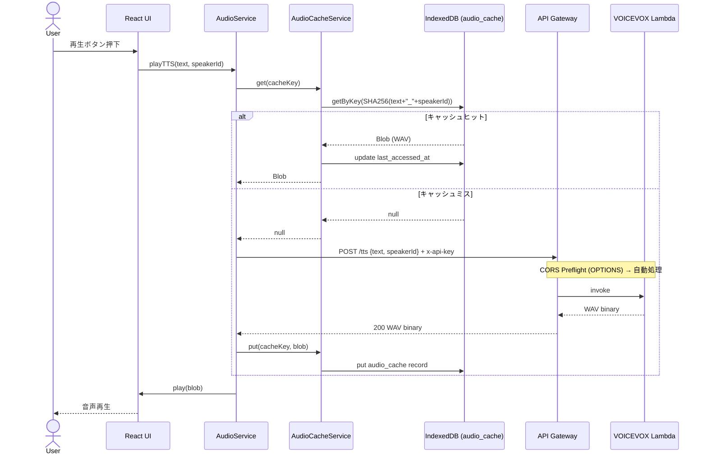
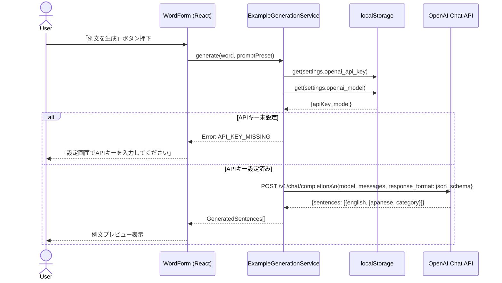
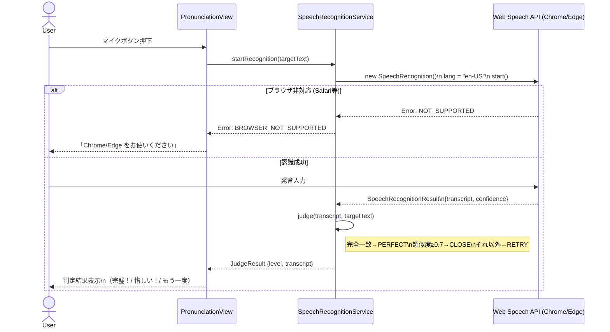
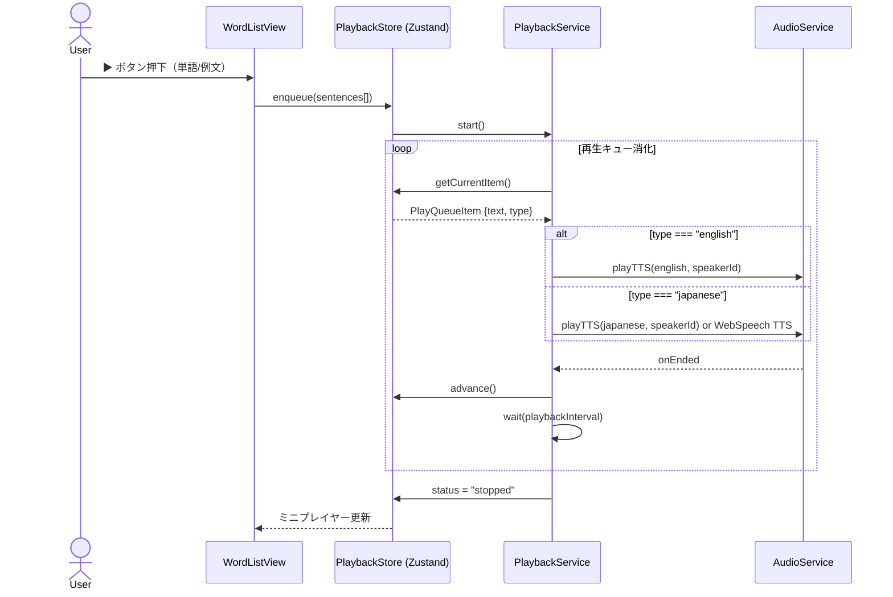
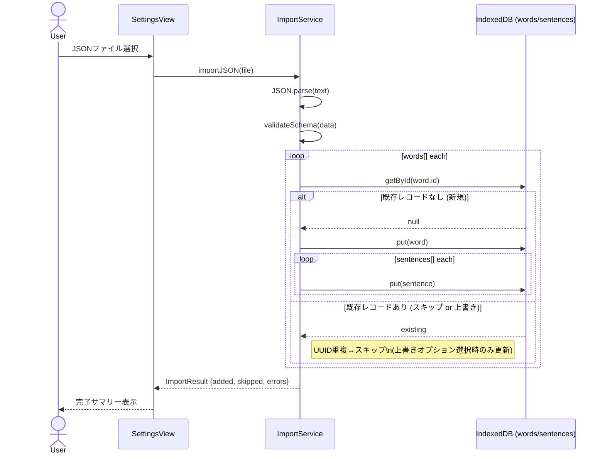

# 詳細設計書 — EnglishLearnApp Web版

**作成日**: 2026-03-20
**対象スタック**: React 19.2 + TypeScript 5.6 + Vite 6 / IndexedDB / Web Speech API / VOICEVOX Lambda / OpenAI API

---

## 1. シーケンス図

### 1-1. VOICEVOX 音声合成フロー（キャッシュあり/なし）



### 1-2. OpenAI 例文生成フロー



### 1-3. 発音チェックフロー（Web Speech API）



### 1-4. 連続再生キューフロー（ミニプレイヤー）



### 1-5. JSON インポートフロー



---

## 2. クライアントサービス仕様

### 2-1. `AudioService`

```typescript
interface AudioService {
  /** VOICEVOX Lambda または Web Speech API で音声を再生する */
  playTTS(text: string, speakerId: number, voice: VoiceType): Promise<void>;
  /** 再生を中断する */
  stop(): void;
  /** 現在再生中かどうか */
  readonly isPlaying: boolean;
}

type VoiceType = 'voicevox' | 'web_speech_default' | 'web_speech_female' | 'web_speech_male';
```

**エラーハンドリング**:

| エラー | 原因 | 対応 |
|--------|------|------|
| `FETCH_TIMEOUT` | Lambda コールドスタート（30秒超） | ローディング UI 表示、30秒でタイムアウト、Web Speech にフォールバック |
| `CORS_ERROR` | CORS 設定不備 | コンソールログ + トースト通知 |
| `NETWORK_ERROR` | オフライン | キャッシュ済み音声のみ再生、案内トースト表示 |

---

### 2-2. `AudioCacheService`

```typescript
interface AudioCacheService {
  /** キャッシュキー = SHA256(text + "_" + speakerId) */
  get(cacheKey: string): Promise<Blob | null>;
  put(cacheKey: string, text: string, speakerId: number, blob: Blob): Promise<void>;
  /** LRU: last_accessed_at が古い順に削除して maxBytes 以下に収める */
  evict(maxBytes: number): Promise<number>; // 削除したバイト数を返す
  /** キャッシュ使用量（バイト） */
  getUsage(): Promise<number>;
  /** 全削除 */
  clear(): Promise<void>;
}
```

---

### 2-3. `WordRepository`

```typescript
interface WordRepository {
  getAll(filter?: WordFilter): Promise<Word[]>;
  getById(id: string): Promise<Word | null>;
  save(word: WordInput): Promise<Word>;       // 新規 = UUID 自動生成
  update(id: string, patch: Partial<WordInput>): Promise<Word>;
  archive(id: string): Promise<void>;         // status = "archived"
  delete(id: string): Promise<void>;          // status = "deleted", deleted_at 設定
  restore(id: string): Promise<void>;         // status = "active"
  purgeDeleted(olderThanDays?: number): Promise<number>; // 物理削除
}

interface WordFilter {
  status?: 'active' | 'archived' | 'deleted';
  initial?: string;   // 頭文字フィルタ A-Z
  category?: string;
  query?: string;     // 全文検索
  sortBy?: 'word' | 'created_at' | 'sentence_count';
  sortOrder?: 'asc' | 'desc';
}
```

---

### 2-4. `ExampleGenerationService`

```typescript
interface ExampleGenerationService {
  generate(
    word: string,
    options: GenerationOptions
  ): Promise<GeneratedSentence[]>;
}

interface GenerationOptions {
  promptPreset: PromptPreset;
  model: string;       // gpt-4o, gpt-4o-mini 等
  apiKey: string;
}

interface GeneratedSentence {
  english: string;
  japanese: string;
  category: string;
}
```

**OpenAI レスポンス JSON スキーマ**:

```json
{
  "type": "object",
  "properties": {
    "sentences": {
      "type": "array",
      "items": {
        "type": "object",
        "properties": {
          "english": { "type": "string" },
          "japanese": { "type": "string" },
          "category": { "type": "string" }
        },
        "required": ["english", "japanese", "category"]
      }
    }
  }
}
```

---

### 2-5. `SpeechRecognitionService`

```typescript
interface SpeechRecognitionService {
  /** Web Speech API が利用可能かチェック */
  isSupported(): boolean;
  /** 録音開始 → 認識結果を返す */
  recognize(lang?: string): Promise<RecognitionResult>;
  stop(): void;
}

interface RecognitionResult {
  transcript: string;
  confidence: number;
}

/** 正誤判定ロジック (純粋関数) */
function judge(transcript: string, target: string): JudgeLevel;
type JudgeLevel = 'PERFECT' | 'CLOSE' | 'RETRY';
// 判定基準: 完全一致(normalize後) → PERFECT / Levenshtein類似度≥0.7 → CLOSE / その他 → RETRY
```

---

### 2-6. `PlaybackStore` (Zustand)

```typescript
interface PlaybackState {
  queue: PlayQueueItem[];
  currentIndex: number;
  status: 'idle' | 'playing' | 'paused' | 'stopped';
  mode: 'bilingual' | 'english_only';
  interval: number;  // seconds

  // Actions
  enqueue: (sentences: Sentence[], mode?: PlayMode) => void;
  play: () => void;
  pause: () => void;
  stop: () => void;
  next: () => void;
  prev: () => void;
  reorder: (fromIndex: number, toIndex: number) => void;
  removeAt: (index: number) => void;
}

interface PlayQueueItem {
  id: string;
  wordId: string;
  sentenceId: string;
  english: string;
  japanese: string;
  type: 'english' | 'japanese';
}
```

---

## 3. 画面・コンポーネント構成

```
src/
├── pages/
│   ├── WordListPage.tsx          # 単語一覧（検索・フィルタ・ソート）
│   ├── WordFormPage.tsx          # 単語追加・編集
│   ├── SentenceListPage.tsx      # 例文一覧
│   ├── PronunciationPage.tsx     # 発音練習
│   ├── ArchivePage.tsx           # アーカイブ一覧
│   ├── TrashPage.tsx             # ゴミ箱
│   └── SettingsPage.tsx          # 設定
├── components/
│   ├── MiniPlayer/               # 常駐ミニプレイヤー
│   ├── FullPlayer/               # フルプレイヤー（ドラッグ並び替え）
│   ├── WordCard/                 # 単語カード（スワイプ操作）
│   └── OnboardingWizard/         # 初回設定ウィザード
├── services/
│   ├── audioService.ts
│   ├── audioCacheService.ts
│   ├── wordRepository.ts
│   ├── sentenceRepository.ts
│   ├── exampleGenerationService.ts
│   └── speechRecognitionService.ts
├── stores/
│   ├── playbackStore.ts           # Zustand
│   └── settingsStore.ts           # Zustand (localStorage 同期)
└── db/
    └── indexedDB.ts               # idb ライブラリ初期化・マイグレーション
```

---

## 4. ルーティング設計

React Router v7（HashRouter — S3/CloudFront 対応）

| パス | コンポーネント | 説明 |
|------|--------------|------|
| `/#/` | `WordListPage` | 単語一覧（デフォルト） |
| `/#/words/new` | `WordFormPage` | 単語追加 |
| `/#/words/:id/edit` | `WordFormPage` | 単語編集 |
| `/#/words/:id/sentences` | `SentenceListPage` | 例文一覧 |
| `/#/words/:id/pronunciation/:sentenceId` | `PronunciationPage` | 発音練習 |
| `/#/archive` | `ArchivePage` | アーカイブ |
| `/#/trash` | `TrashPage` | ゴミ箱 |
| `/#/settings` | `SettingsPage` | 設定 |

---

## 5. エラーハンドリング方針

| レイヤー | エラー種別 | 対応 |
|---------|----------|------|
| IndexedDB | QuotaExceededError | 音声キャッシュを LRU で削減後リトライ |
| IndexedDB | VersionError | ページリロード案内（DB バージョン不整合） |
| VOICEVOX Lambda | タイムアウト（>30秒） | Web Speech API にフォールバック + トースト通知 |
| VOICEVOX Lambda | CORS Error | コンソールログ + 「音声が利用できません」表示 |
| OpenAI API | 401 Unauthorized | 「APIキーが無効です」→ 設定画面へ誘導 |
| OpenAI API | 429 Rate Limit | 「しばらく待ってから再試行してください」|
| OpenAI API | APIキー未設定 | 「設定画面でAPIキーを入力してください」|
| Web Speech API | NOT_SUPPORTED | 「Chrome/Edge をお使いください」バナー表示 |
| Web Speech API | NO_SPEECH | 「音声が聞こえませんでした。もう一度どうぞ」|
| ネットワーク全般 | offline | キャッシュ済み機能のみ利用可 + オフラインバナー |

---

## 6. 環境変数・設定値

### ビルド時定数（Vite `import.meta.env`）

| 変数 | 説明 | 例 |
|------|------|----|
| `VITE_APP_VERSION` | アプリバージョン | `1.0.0` |
| `VITE_APP_ENV` | 環境識別子 | `poc` / `dev` / `pro` |

> VOICEVOX の Base URL・API キー・OpenAI API キーはビルド時に埋め込まず、**localStorage に保存**する（個人利用想定のため）。

### localStorage 設定値（ランタイム）

| キー | デフォルト値 | 説明 |
|------|------------|------|
| `settings.voicevox_base_url` | `""` | VOICEVOX Lambda エンドポイント |
| `settings.voicevox_api_key` | `""` | API Gateway キー |
| `settings.openai_api_key` | `""` | OpenAI API キー |
| `settings.openai_model` | `"gpt-4o-mini"` | 使用モデル |
| `settings.voice_en` | `"voicevox"` | 英語音声種別 |
| `settings.voice_ja` | `"voicevox"` | 日本語音声種別 |
| `settings.voicevox_speaker_id` | `3` | ずんだもんノーマル |
| `settings.playback_mode` | `"bilingual"` | 連続再生モード |
| `settings.playback_interval` | `1.0` | 例文間隔（秒） |
| `settings.audio_cache_max_mb` | `100` | 音声キャッシュ上限（MB） |

---

## 7. IndexedDB 初期化・マイグレーション

```typescript
// db/indexedDB.ts (idb ライブラリ使用)
import { openDB } from 'idb';

export const db = openDB('EnglishLearnDB', 1, {
  upgrade(db, oldVersion) {
    if (oldVersion < 1) {
      // words store
      const words = db.createObjectStore('words', { keyPath: 'id' });
      words.createIndex('status', 'status');
      words.createIndex('created_at', 'created_at');
      words.createIndex('word', 'word');

      // sentences store
      const sentences = db.createObjectStore('sentences', { keyPath: 'id' });
      sentences.createIndex('word_id', 'word_id');
      sentences.createIndex('word_id_sort', ['word_id', 'sort_order']);

      // audio_cache store
      const audioCache = db.createObjectStore('audio_cache', { keyPath: 'id' });
      audioCache.createIndex('created_at', 'created_at');
      audioCache.createIndex('last_accessed_at', 'last_accessed_at');
    }
  },
});
```

**アプリ起動時の自動パージ**:

```typescript
// アプリ起動時に deleted_at < (today - 10日) のレコードを物理削除
async function purgeOldDeleted() {
  const threshold = new Date(Date.now() - 10 * 24 * 60 * 60 * 1000).toISOString();
  const db = await getDB();
  const tx = db.transaction('words', 'readwrite');
  const index = tx.store.index('status');
  for await (const cursor of index.iterate('deleted')) {
    if (cursor.value.deleted_at && cursor.value.deleted_at < threshold) {
      await cursor.delete();
    }
  }
}
```

---

## 8. テスト仕様

### 8-1. 単体テスト（Vitest）

| テスト対象 | テスト内容 |
|-----------|----------|
| `audioCacheService` | キャッシュヒット/ミス・LRU 削除・使用量計算 |
| `wordRepository` | CRUD・フィルタ・ソート・ソフトデリート・物理パージ |
| `exampleGenerationService` | APIキー未設定エラー・正常レスポンスのパース |
| `speechRecognitionService` | `judge()` 関数の完全一致/類似度/不一致ケース |
| `importService` | JSON パース・UUID重複スキップ・上書きオプション |
| `playbackStore` | enqueue/next/prev/reorder/removeAt |

**モック方針**:
- IndexedDB: `fake-indexeddb` ライブラリで実際の IDB API をエミュレート
- OpenAI API: `vi.mock` で fetch をスタブ
- Web Speech API: `vi.mock('SpeechRecognition')` でスタブ

---

### 8-2. 結合テスト（Vitest + MSW）

| シナリオ | 検証内容 |
|---------|---------|
| VOICEVOX TTS → キャッシュ保存 → 再利用 | 2回目以降 fetch が呼ばれないこと |
| OpenAI 例文生成 → IndexedDB 保存 | 生成した例文が正しく IDB に保存されること |
| JSON インポート → 一覧表示 | インポート後に単語一覧に反映されること |
| 連続再生キュー → 全例文再生完了 | キュー消化後 status が `stopped` になること |

---

### 8-3. E2E テスト（Playwright — Chrome/Edge 限定）

| シナリオ | 対象ブラウザ |
|---------|------------|
| オンボーディング → APIキー設定 → 単語追加 → 例文生成 | Chrome |
| 単語一覧 → 連続再生開始 → ミニプレイヤー表示 | Chrome, Edge |
| 発音練習 → Web Speech 認識 → 判定結果表示 | Chrome |
| JSON エクスポート → インポート → データ整合性確認 | Chrome |
| Safari でのブラウザ非対応バナー表示 | Safari (WebKit) |
