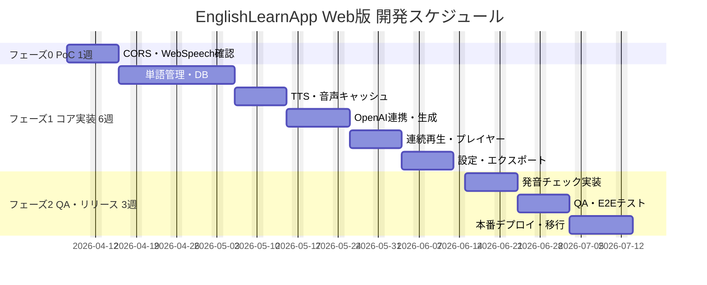

# 提案書 — EnglishLearnApp Web版

**作成日**: 2026-03-20
**対象**: iOS版「EnglishLearnApp」のWeb移植

---

## エグゼクティブサマリー

iOS版「EnglishLearnApp」のWeb版を、**最小コストで最大機能を実現する**設計で提案します。バックエンドサーバーを持たないサーバーレス SPA（React 19.2 + S3 + CloudFront）とし、既存 VOICEVOX Lambda エンドポイントを再利用することで、AWSインフラ追加コストを **¥1,038/月** に抑えます。

| 項目 | 内容 |
|------|------|
| 対応可否 | **対応可能** |
| 推奨アーキテクチャ | React SPA → S3 + CloudFront（サーバーレス） |
| 総工数 | **96人日**（バッファ込み） |
| 初期開発費 | **¥9,600,000** |
| AWS追加月額 | **¥1,038/月**（CloudFront + S3 + Lambda増分） |
| 3年間 TCO | **¥11,977,368** |
| リスク | 中（Web Speech API ブラウザ依存・APIキー露出・Lambda コールドスタート） |

---

## アーキテクチャ比較と選定根拠

### 比較検討

| 案 | 構成 | 月額インフラ | 工数追加 | 推奨 |
|----|------|------------|---------|------|
| **案A（推奨）** | React SPA + S3 + CloudFront | ¥1,038 | 0 | ✅ |
| 案B | React SPA + ECS Fargate (FastAPI BFF) | ¥15,000〜 | +15人日 | — |
| 案C | Next.js SSR + ECS | ¥20,000〜 | +25人日 | — |

**案A を推奨する理由**:
- 個人利用想定のため、バックエンドサーバーのセキュリティ要件（認証・認可）が不要
- 既存 iOS版 Lambda を CORS 設定追加のみで再利用できる
- IndexedDB によるクライアントサイドストレージで iOS版の FileManager 相当を実現
- S3 + CloudFront は管理不要なマネージドサービスで運用コストが最小

---

## 開発フェーズ計画

| フェーズ | スコープ | 期間 |
|---------|---------|------|
| フェーズ0 | CORS確認・Web Speech API PoC・IndexedDB 動作確認 | 1週 |
| フェーズ1 | 単語管理・TTS・OpenAI連携・連続再生・設定 | 6週 |
| フェーズ2 | 発音チェック・QA・S3/CloudFront 本番デプロイ・データ移行 | 3週 |

### ガントチャート

---

## 工数・費用見積もり

| カテゴリ | 工数 | 費用 |
|---------|------|------|
| 実装（15機能） | 40人日 | ¥4,000,000 |
| テスト（単体・結合・E2E） | 14人日 | ¥1,400,000 |
| フェーズ0 PoC | 5人日 | ¥500,000 |
| バッファ（25%） | 14人日 | ¥1,400,000 |
| インフラ構築（S3/CF/CDK） | 3人日 | ¥300,000 |
| プロジェクト管理・調整 | 20人日 | ¥2,000,000 |
| **合計** | **96人日** | **¥9,600,000** |

---

## コスト比較（3年間 TCO）

| | iOS版 | Web版 |
|--|-------|-------|
| 初期開発費 | ¥（既存） | ¥9,600,000 |
| AWSインフラ（3年） | ¥（既存） | ¥37,368 |
| 運用・保守（3年） | ¥（既存） | ¥2,340,000 |
| **3年間 TCO** | **¥（既存）** | **¥11,977,368** |

> Web版固有のインフラ追加コストは **¥37,368（3年間）** と極めて低く、iOS版の既存インフラ投資を最大限活用できます。

---

## リスク評価と対応策

| リスク | 影響度 | 発生確率 | 対策 |
|--------|--------|---------|------|
| Web Speech API 非対応（Safari） | 中 | 高 | Chrome/Edge 推奨案内 UI を実装。発音チェック以外は全ブラウザ対応 |
| VOICEVOX Lambda コールドスタート（最大30秒） | 中 | 高 | ローディング UI + IndexedDB 音声キャッシュで再生成を最小化 |
| OpenAI API キー露出（localStorage） | 中 | 低 | 個人利用前提で許容。説明文で周知 |
| IndexedDB 容量超過 | 低 | 中 | LRU でキャッシュ自動削減 + 設定画面から手動クリア |
| CORS 設定ミス | 高 | 低 | poc 環境で事前検証 + Playwright E2E テスト自動化 |

---

## 推奨事項・次のステップ

**推奨オプション: 案A（React SPA + S3 + CloudFront）**

iOS版インフラの CORS 設定追加のみで Web版に対応でき、技術リスクが最も低く、運用コストも最小化できます。

**次のステップ**:
1. VOICEVOX Lambda の API Gateway エンドポイント URL と API キーを共有いただく（CORS 設定追加のため）
2. Web版ドメイン名を確定する（CloudFront カスタムドメイン）
3. ずんだもんキャラクター利用規約の確認・同意（お客様対応）
4. フェーズ0 PoC（1週間）で CORS 動作確認と Web Speech API の動作検証
5. フェーズ1 開発着手

---

## 参考資料

- [case3/output/app/design-doc.md] Web版アプリ 詳細設計書
- [case3/output/app/db-design.md] DB設計書（IndexedDB）
- [case3/output/app/detail-design.md] 詳細設計書（シーケンス図・サービス仕様）
- [case3/output/app/running-cost.md] 運用コスト試算
- [case3/output/app/investigation-report.md] 不明点調査レポート
