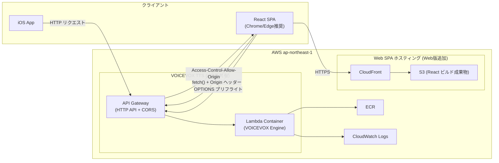

# 設計書 — VOICEVOX TTS インフラ Web版対応 (AWS CDK)

**作成日**: 2026-03-20
**対象スタック**: AWS CDK TypeScript / Lambda Container / API Gateway HTTP API / CloudFront + S3

---

## 概要

iOS版で稼働中の VOICEVOX TTS Lambda インフラに、ブラウザ（React SPA）からのアクセスを可能にする最小限の改修を行う。iOS版の Lambda・API Gateway・CDK 資産をそのまま活用し、CORS 設定と CloudFront + S3 SPA ホスティングを追加する。

---

## 技術的実現可否

**判断: 対応可能（iOS版インフラへの差分追加のみ）**

API Gateway HTTP API は CORS をネイティブサポートしており、`corsPreflight` 設定のみでブラウザからのリクエストに対応できる。CloudFront + S3 は AWS 標準の SPA ホスティング構成として十分なドキュメントと CDK サポートがある。

---

## アーキテクチャ図



---

## アーキテクチャ方針

### iOS版からの変更点

#### CORS 設定の追加（`VoicevoxStack.ts`）

```typescript
const api = new apigateway.HttpApi(this, 'VoicevoxApi', {
  corsPreflight: {
    allowOrigins: props.corsAllowOrigins,
    allowMethods: [
      apigateway.CorsHttpMethod.GET,
      apigateway.CorsHttpMethod.POST,
      apigateway.CorsHttpMethod.OPTIONS,
    ],
    allowHeaders: [
      'Content-Type',
      'x-api-key',
    ],
    maxAge: cdk.Duration.days(1),
  },
});
```

#### 環境別 CORS 設定

| 環境 | corsAllowOrigins | 備考 |
|------|----------------|------|
| poc | `['*']` | ローカル開発含む暫定設定 |
| dev | `['https://dev.englishlearn.example.com', 'http://localhost:5173']` | React dev サーバー含む |
| pro | `['https://englishlearn.example.com']` | 本番ドメインのみ |

---

### 新規追加: `WebAppStack`（CloudFront + S3）

```typescript
// WebAppStack.ts
export class WebAppStack extends cdk.Stack {
  constructor(scope: Construct, id: string, props: WebAppStackProps) {
    // S3 バケット（OAC 使用）
    const bucket = new s3.Bucket(this, 'SpaAssets', {
      blockPublicAccess: s3.BlockPublicAccess.BLOCK_ALL,
    });

    // CloudFront Distribution
    const distribution = new cloudfront.Distribution(this, 'Distribution', {
      defaultBehavior: {
        origin: cloudfrontOrigins.S3BucketOrigin.withOriginAccessControl(bucket),
        viewerProtocolPolicy: cloudfront.ViewerProtocolPolicy.REDIRECT_TO_HTTPS,
        cachePolicy: cloudfront.CachePolicy.CACHING_OPTIMIZED,
      },
      defaultRootObject: 'index.html',
      // SPA ルーティング: 404 → index.html
      errorResponses: [
        {
          httpStatus: 403,
          responseHttpStatus: 200,
          responsePagePath: '/index.html',
        },
        {
          httpStatus: 404,
          responseHttpStatus: 200,
          responsePagePath: '/index.html',
        },
      ],
    });
  }
}
```

---

### CDK スタック構成

| スタック | 内容 | iOS版との関係 |
|---------|------|-------------|
| `VoicevoxStack` | Lambda Container + API Gateway + CORS | iOS版と共有（CORS 設定追加） |
| `WebAppStack` | CloudFront + S3 SPA ホスティング | **Web版新規** |

---

## 機能一覧と工数見積もり（iOS版インフラからの差分）

| # | 機能 | 内容 | 工数（人日） |
|---|------|------|-----------|
| 1 | CORS 設定追加 | CDK `corsAllowOrigins` を環境別に設定 | 0.5 |
| 2 | CloudFront + S3 SPA ホスティング | `WebAppStack` CDK 定義 | 1.0 |
| 3 | CI/CD CloudFront Invalidation 追加 | GitHub Actions に invalidation step 追加 | 0.3 |
| 4 | CORS E2E テスト | Playwright でブラウザからの fetch 動作確認 | 0.2 |
| | **合計** | | **2.0人日** |

---

## フェーズ計画

| フェーズ | スコープ | 工数 |
|---------|---------|------|
| フェーズ1（iOS版共通） | CDK 整備・CI/CD・環境分離（iOS版と共通） | 10人日 |
| フェーズ1.5（Web版追加） | CORS + CloudFront/S3 対応（フェーズ1と並行） | 2人日 |
| フェーズ2（共通） | S3 音声キャッシュ・監視・アラート | 10人日 |
| **合計** | | **22人日** |

---

## 不明点・確認事項

1. **iOS版 Lambda との API キー共用可否**: 同一エンドポイント・API キーを共用するか分離するか
2. **本番ドメイン**: CloudFront カスタムドメイン（`englishlearn.example.com` 等）の確定
3. **ローカル開発 CORS**: `localhost:5173` を dev 環境の CORS 許可リストに含めるか

---

## リスク・考慮事項

- **CORS 設定の先行確認**: poc 環境へのデプロイ後、ブラウザからの fetch で動作確認を必ず実施する
- **WAF 非適用（個人利用）**: Web 公開後は不特定多数からのアクセスが可能になる。ユーザー規模が増えた場合は WAF（AWS WAF: ¥5,300/月〜）の適用を検討する
- **OAC（Origin Access Control）**: CDK v2 では `S3BucketOrigin.withOriginAccessControl()` が推奨。旧方式の OAI は非推奨
