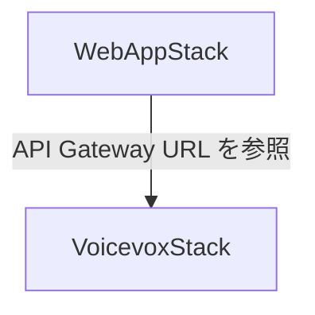

# インフラ設計書 — VOICEVOX TTS インフラ Web版対応 (AWS CDK)

**作成日**: 2026-03-20
**対象**: CDK スタック構成・環境管理・パラメータ設計

> Web版 TTS インフラはサーバーレス構成のため RDB は持ちません。本ドキュメントでは CDK スタックのパラメータ管理・環境別設定・Secrets Manager / SSM Parameter Store の利用方針を定義します。

---

## 1. CDK スタック構成

### スタック一覧

| スタック | ファイル | 用途 |
|---------|---------|------|
| `VoicevoxStack` | `lib/voicevox-stack.ts` | Lambda Container + API Gateway（iOS版と共有） |
| `WebAppStack` | `lib/web-app-stack.ts` | CloudFront + S3 SPA ホスティング（Web版新規） |

### スタック依存関係



`WebAppStack` は `VoicevoxStack` の API Gateway エンドポイント URL を参照するため、`VoicevoxStack` を先にデプロイすること。

---

## 2. 環境別パラメータ設計

### CDK Context（`cdk.json`）

```json
{
  "context": {
    "poc": {
      "corsAllowOrigins": ["*"],
      "domainName": null,
      "lambdaMemory": 2048,
      "rateLimit": 5
    },
    "dev": {
      "corsAllowOrigins": [
        "https://dev.englishlearn.example.com",
        "http://localhost:5173"
      ],
      "domainName": "dev.englishlearn.example.com",
      "lambdaMemory": 2048,
      "rateLimit": 10
    },
    "pro": {
      "corsAllowOrigins": ["https://englishlearn.example.com"],
      "domainName": "englishlearn.example.com",
      "lambdaMemory": 3008,
      "rateLimit": 50
    }
  }
}
```

---

## 3. シークレット管理

### Secrets Manager / SSM Parameter Store

| パラメータ | 管理方法 | パス | 備考 |
|-----------|---------|------|------|
| VOICEVOX API Gateway エンドポイント URL | SSM Parameter Store | `/englishlearn/{env}/voicevox/api-url` | 非機密情報 |
| VOICEVOX API キー | Secrets Manager | `/englishlearn/{env}/voicevox/api-key` | 機密情報 |
| CloudFront Distribution ID | SSM Parameter Store | `/englishlearn/{env}/cloudfront/distribution-id` | CI/CD Invalidation 用 |
| S3 バケット名 | SSM Parameter Store | `/englishlearn/{env}/s3/spa-bucket-name` | CI/CD デプロイ用 |

> **ブラウザ側の API キー**: VOICEVOX API キーは Lambda 環境変数に格納し、CloudFront Functions でヘッダーに付与する方式を推奨。React SPA のコードには含めない。（PoC では localStorage 保存も可）

---

## 4. CDK ディレクトリ構成

```
aws/
├── bin/
│   └── app.ts              # CDK App エントリポイント（環境別スタック生成）
├── lib/
│   ├── voicevox-stack.ts   # VOICEVOX Lambda + API Gateway（iOS版と共有）
│   └── web-app-stack.ts    # CloudFront + S3（Web版新規）
├── config/
│   └── environments.ts     # 環境別パラメータ型定義
├── test/
│   ├── voicevox-stack.test.ts
│   └── web-app-stack.test.ts
├── cdk.json
└── package.json
```

---

## 5. 環境別デプロイコマンド

```bash
# VoicevoxStack（iOS版と共有 — CORS 追加）
npm run deploy:poc    # cdk deploy VoicevoxStack --context env=poc
npm run deploy:dev    # cdk deploy VoicevoxStack --context env=dev
npm run deploy:pro    # cdk deploy VoicevoxStack --context env=pro

# WebAppStack（Web版新規）
npm run deploy:web:poc   # cdk deploy WebAppStack --context env=poc
npm run deploy:web:dev   # cdk deploy WebAppStack --context env=dev
npm run deploy:web:pro   # cdk deploy WebAppStack --context env=pro
```

---

## 6. CDK テスト仕様

| テスト | 検証内容 |
|--------|---------|
| `VoicevoxStack` の CORS 設定 | `corsAllowOrigins` が環境ごとに正しく設定されていること |
| `WebAppStack` の S3 バケット | パブリックアクセスがブロックされていること |
| `WebAppStack` の CloudFront | `errorResponses` に 404→index.html の設定があること |
| `WebAppStack` の OAC | `S3BucketOrigin.withOriginAccessControl()` が使用されていること |

---

## 7. スタック削除順序

CloudFront が参照している S3 バケットや API Gateway を先に削除するとエラーになるため、以下の順序で削除すること。

1. `WebAppStack` を削除
2. `VoicevoxStack` を削除

（CDK `destroy` コマンドでは依存関係に注意すること）
