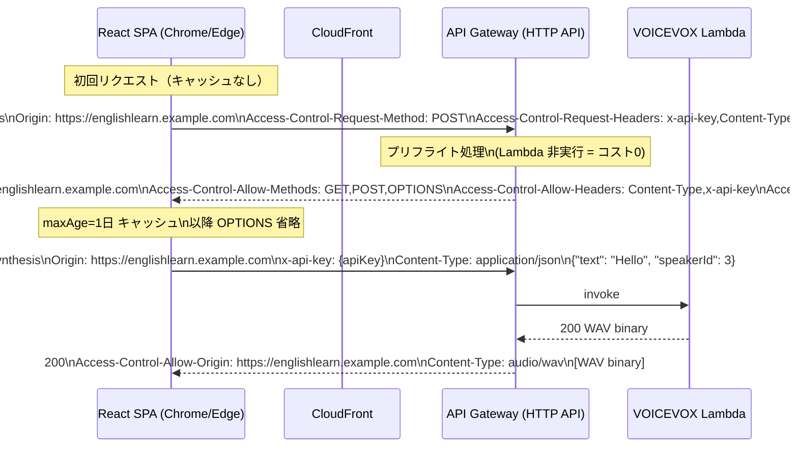
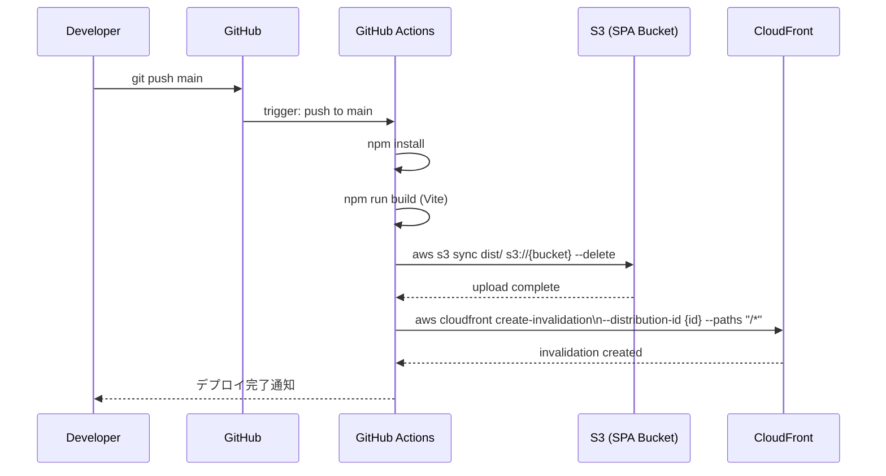
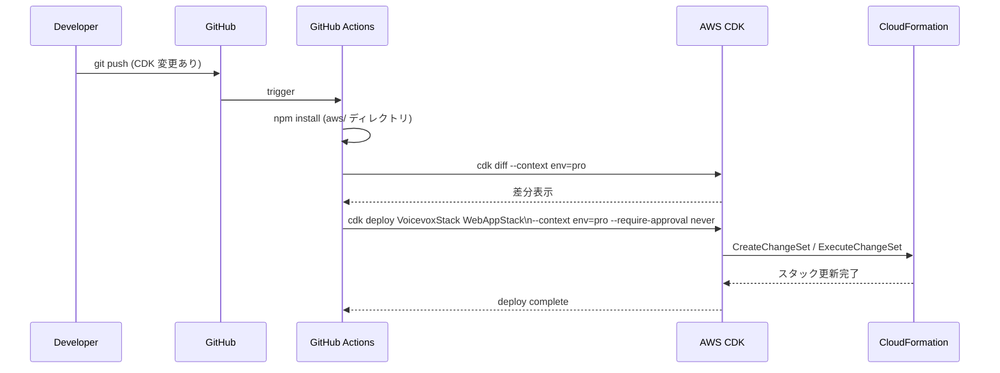

# 詳細設計書 — VOICEVOX TTS インフラ Web版対応 (AWS CDK)

**作成日**: 2026-03-20
**対象**: CORS 設定追加・CloudFront + S3 SPA ホスティング・CI/CD 更新

---

## 1. シーケンス図

### 1-1. CORS プリフライトリクエストフロー



### 1-2. React SPA デプロイフロー（GitHub Actions）



### 1-3. CDK デプロイフロー（インフラ変更時）



---

## 2. VoicevoxStack 詳細仕様

### CORS 設定パラメータ

```typescript
interface VoicevoxStackProps extends cdk.StackProps {
  env_name: 'poc' | 'dev' | 'pro';
  corsAllowOrigins: string[];  // 環境別許可オリジン
  lambdaMemory: number;        // 2048 (poc/dev) | 3008 (pro)
  rateLimit: number;           // 5 (poc) | 10 (dev) | 50 (pro) RPS
}
```

### API エンドポイント仕様

| エンドポイント | メソッド | 説明 |
|-------------|---------|------|
| `POST /synthesis` | POST | テキストから音声合成（WAV バイナリを返す） |
| `GET /speakers` | GET | 利用可能なスピーカー一覧を返す |
| `OPTIONS /*` | OPTIONS | CORS プリフライト（API Gateway が自動処理） |

### リクエスト/レスポンス仕様

**POST /synthesis**

```
Request:
  Headers:
    Content-Type: application/json
    x-api-key: {apiKey}
    Origin: https://englishlearn.example.com  (ブラウザが自動付与)
  Body:
    {
      "text": "Hello, this is an important decision.",
      "speakerId": 3
    }

Response:
  Status: 200
  Headers:
    Content-Type: audio/wav
    Access-Control-Allow-Origin: https://englishlearn.example.com
  Body: [WAV binary]
```

---

## 3. WebAppStack 詳細仕様

### CloudFront 設定

| 設定項目 | 値 | 備考 |
|---------|---|------|
| Origin | S3 (OAC 使用) | S3 バケットへのパブリックアクセスは禁止 |
| Viewer Protocol Policy | Redirect HTTP → HTTPS | |
| Cache Policy | `CACHING_OPTIMIZED` | 静的アセット（JS/CSS/images）向け |
| Default Root Object | `index.html` | |
| Error Response (403) | `index.html` (200) | React Router SPA 対応 |
| Error Response (404) | `index.html` (200) | React Router SPA 対応 |
| Price Class | `PriceClass100` (US/Europe/Asia) | 日本含む標準クラス |

### S3 バケット設定

| 設定項目 | 値 |
|---------|---|
| パブリックアクセス | すべてブロック |
| バケットポリシー | CloudFront OAC のみ許可 |
| バージョニング | 無効（コスト削減） |
| ライフサイクル | なし（SPA ビルド成果物は上書き管理） |

---

## 4. CI/CD 詳細仕様

### GitHub Actions ワークフロー

```yaml
# .github/workflows/deploy-web.yml
name: Deploy Web SPA

on:
  push:
    branches: [main]
    paths:
      - 'web/**'    # React SPA ソース変更時のみ

jobs:
  deploy:
    runs-on: ubuntu-latest
    steps:
      - uses: actions/checkout@v4
      - uses: actions/setup-node@v4
        with:
          node-version: '22'

      - name: Install dependencies
        run: npm ci
        working-directory: web/

      - name: Build
        run: npm run build
        working-directory: web/
        env:
          VITE_APP_ENV: pro
          VITE_APP_VERSION: ${{ github.sha }}

      - name: Deploy to S3
        run: |
          aws s3 sync dist/ s3://${{ secrets.S3_BUCKET_NAME }} \
            --delete \
            --cache-control "max-age=31536000,immutable" \
            --exclude "index.html"
          aws s3 cp dist/index.html s3://${{ secrets.S3_BUCKET_NAME }}/index.html \
            --cache-control "no-cache,no-store"

      - name: Invalidate CloudFront
        run: |
          aws cloudfront create-invalidation \
            --distribution-id ${{ secrets.CLOUDFRONT_DISTRIBUTION_ID }} \
            --paths "/*"
```

> **キャッシュ戦略**: Vite はビルド時にハッシュ付きファイル名を生成するため、JS/CSS/画像は長期キャッシュ（1年）。`index.html` のみキャッシュ無効化で最新版を配信。

---

## 5. エラーハンドリング方針

| エラーケース | 発生条件 | 対応 |
|-----------|---------|------|
| CORS エラー | `corsAllowOrigins` に含まれないオリジンからのリクエスト | 403 + CORS ヘッダーなし → ブラウザでエラー表示 |
| Lambda タイムアウト | VOICEVOX コールドスタート | 30秒タイムアウト設定。ブラウザ側でローディング UI |
| S3 403 Forbidden | OAC 設定ミス | CloudFront が S3 にアクセスできない → ビルド後の動作確認必須 |
| CloudFront 404 | SPA ルーティング | `errorResponses` で `index.html` にリダイレクト |

---

## 6. テスト仕様

### 単体テスト（Jest / CDK Assertions）

| テスト | 検証内容 |
|--------|---------|
| CORS 設定 | `corsAllowOrigins` が環境別に正しく設定されること |
| S3 設定 | パブリックアクセスブロックが有効であること |
| CloudFront 設定 | エラーレスポンス（404→index.html）が設定されていること |
| OAC 設定 | `withOriginAccessControl()` が使用されていること |

### E2E テスト（Playwright — CORS 検証）

| シナリオ | 検証内容 |
|---------|---------|
| 許可オリジンからの TTS リクエスト | `Access-Control-Allow-Origin` ヘッダーが含まれ、音声データが返ること |
| 非許可オリジンからのリクエスト | CORS エラーが発生すること（poc 環境では `*` のため全許可） |
| OPTIONS プリフライト | 200 OK が返り、適切な CORS ヘッダーが含まれること |
| SPA ルーティング | `/words/new` など任意のパスに直接アクセスして `index.html` が返ること |
