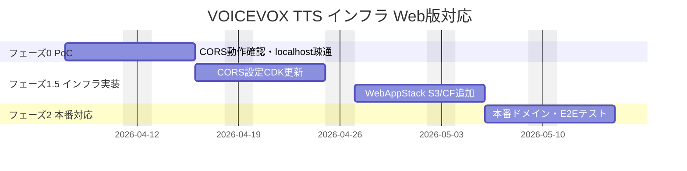

# 提案書 — VOICEVOX TTS インフラ Web版対応 (AWS CDK)

**作成日**: 2026-03-20
**対象**: iOS版 VOICEVOX Lambda インフラへの Web版 CORS 対応 + CloudFront/S3 SPA ホスティング追加

---

## エグゼクティブサマリー

iOS版で稼働中の VOICEVOX TTS Lambda インフラに、ブラウザ（React SPA）からのアクセスを可能にする最小限の改修を提案します。CDK の `corsAllowOrigins` パラメータ追加と CloudFront + S3 スタックの新規追加のみで対応でき、**追加開発費 ¥200,000・月額インフラ追加 ¥871** という極めて低コストで Web版を実現できます。

| 項目 | 内容 |
|------|------|
| 対応可否 | **対応可能** |
| 推奨方式 | 既存 Lambda + CORS 設定追加 + CloudFront/S3 新規追加 |
| 追加工数 | **2人日** |
| 追加開発費 | **¥200,000** |
| AWS追加月額 | **¥871/月** |
| 3年間 TCO 追加分 | **¥1,401,356** |
| リスク | 低（CORS 設定追加・標準 CDK パターン） |

---

## アーキテクチャ選定根拠

### 比較検討

| 案 | 方式 | 月額追加 | 工数追加 | 推奨 |
|----|------|---------|---------|------|
| **案A（推奨）** | 既存 Lambda CORS 追加 + S3/CF SPA | ¥871 | 2人日 | ✅ |
| 案B | Lambda 分離（iOS/Web 別スタック） | ¥1,715 | 8人日 | — |
| 案C | ECS Fargate + ALB（BFF含む） | ¥15,000〜 | +20人日 | — |

**案A を推奨する理由**: アプリ側が完全サーバーレス SPA（IndexedDB + localStorage）なので、バックエンドサーバーが不要。iOS版 Lambda の共有により Lambda コストを最小化。CDK の差分変更のみで対応できるため開発リスクが最低。

---

## 開発フェーズ計画

| フェーズ | スコープ | 期間 |
|---------|---------|------|
| フェーズ0 | CORS 動作 PoC・localhost 疎通確認 | 1日 |
| フェーズ1.5 | CORS 設定 + WebAppStack（CloudFront/S3）CDK 実装 | 1日 |
| フェーズ2 | 本番ドメイン反映・E2E CORS テスト | 0.5日 |

### ガントチャート

---

## 工数・費用見積もり

| カテゴリ | 工数 | 費用 |
|---------|------|------|
| CORS 設定 CDK 更新 | 0.5人日 | ¥50,000 |
| WebAppStack（CloudFront + S3）CDK 実装 | 1.0人日 | ¥100,000 |
| CI/CD CloudFront Invalidation 追加 | 0.3人日 | ¥30,000 |
| CORS E2E テスト（Playwright） | 0.2人日 | ¥20,000 |
| **合計** | **2.0人日** | **¥200,000** |

---

## コスト比較（3年間 TCO）

| 項目 | iOS版のみ | iOS + Web版 | 差分 |
|------|---------|-----------|------|
| インフラ構築費 | ¥（既存） | +¥200,000 | +¥200,000 |
| AWSインフラ（3年） | ¥（既存） | +¥31,356 | +¥31,356 |
| 運用・保守（3年） | ¥（既存共有） | +¥900,000 | +¥900,000 |
| **3年間 TCO 追加分** | | | **+¥1,131,356** |

---

## リスク評価と対応策

| リスク | 影響度 | 発生確率 | 対応策 |
|--------|--------|---------|--------|
| CORS 設定ミスによるブラウザブロック | 高 | 低 | poc 環境で先行検証 + Playwright E2E テスト |
| CloudFront キャッシュによる旧版配信 | 中 | 低 | デプロイ時 Invalidation を GitHub Actions で自動化 |
| Lambda コールドスタート（最大30秒） | 中 | 高 | アプリ側 IndexedDB キャッシュで再生成を最小化 |
| S3 OAC 設定ミスによる403 | 高 | 低 | CDK unit test で OAC 設定を自動検証 |

---

## 推奨事項・次のステップ

**推奨: 案A（既存 Lambda CORS 追加 + CloudFront/S3 SPA ホスティング）**

iOS版インフラへの最小限の追加で Web版に対応でき、技術リスク・コスト・工数のすべてが最低水準です。

**お客様に必要な対応**:

1. iOS版 API Gateway エンドポイント URL と API キーのご提供（CORS 設定追加のため）
2. Web版本番ドメイン名の確定（CloudFront カスタムドメイン用）
3. ずんだもんキャラクター利用規約の確認・同意（Web 公開前に必須）
4. iOS版と Web版の API キー共用・分離方針のご確認

---

## 参考資料

- [case3/output/aws/design-doc.md] インフラ設計書（CORS + CDK スタック）
- [case3/output/aws/db-design.md] CDK パラメータ・環境設計
- [case3/output/aws/detail-design.md] 詳細設計書（シーケンス図・テスト仕様）
- [case3/output/aws/running-cost.md] 運用コスト試算
- [case3/output/aws/investigation-report.md] 不明点調査レポート
